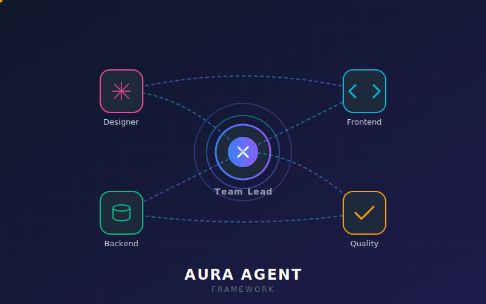

# 🤖 AuraAgent Framework

  

**AuraAgent Framework**, LLM (Büyük Dil Modelleri) tabanlı otonom yapay zeka ajanlarının bir takım olarak, standart operasyonel kurallarla (Agile/Scrum mantığında) kod ve ürün geliştirilmesini sağlayan bir klasör-yapısı (scaffolding) sistemidir.

Bu iskelet yapı sayesinde, favori yapay zeka aracınıza (Antigravity, Cursor, Claude, ChatGPT vb.) projenizin bulunduğu klasörü vererek, spesifik rollere sahip ajanların birbiriyle sistematik bir şekilde çalışmasını sağlayabilirsiniz.

---

## 📂 Klasör Yapısı (Folder Structure)

AuraAgent Framework üç temel bileşenden oluşur:

### 1. `agents/` 
Her ajanın karakterini, sorumluluklarını ve kurallarını (`role.md`) barındırır:
- **Team Lead:** Projeyi yönetir, gereksinimleri parçalar, log tutar ve iş bölümü yapar.
- **Designer:** Arayüz (UI) ve kullanıcı deneyimini (UX) modern standartlara göre tasarlar.
- **Frontend:** Tasarımları "Clean Code" prensiplerine (SRP, DRY) sadık kalarak koda döker.
- **Backend:** Güvenli, performanslı ve ölçeklenebilir arkayüz & veritabanı mimarisini kurar.

### 2. `operations/` 
Ekibin bir arada hata yapmadan çalışmasını sağlayan senkronizasyon merkezidir:
- **`hub/`:** Günlük görev takip tahtası (task board) ve ajan durumları yer alır.
- **`communication/`:** Ajanların birbirine devrettiği (handoff) görevlerin dili ve kuralı yer alır.
- **`workflows/`:** Yeni bir özelliğin (feature) uçtan uca nasıl geliştirileceği ve "Code Review" süreçleri tanımlıdır.
- **`quality/`:** Frontend ve Backend için belirlenmiş kalite kapıları (Quality Gates) bulunur.
- **`tracking/`:** Sprint özeti bu klasörde arşivlenir.

### 3. `context/` 
Projenin "Hafıza Merkezi"dir. Bağlam kaybını önler.
- **`rules.md`:** Projeye özel kalıcı kurallar (kullanılacak teknolojiler, mimariler) bulunur.
- **`requirements.md`:** Kullanıcının asıl vizyonu ve ürün ihtiyaçları (PRD) yer alır.
- **`log.md`:** Ajanların yaptığı her işlemi tarihçesiyle işleyerek token/context sıfırlanmasında hafıza kaybını engeller.

---

## 🚀 Nasıl Kullanılır?

1. Bu proje yapısını hedef çalışma klasörünüze kopyalayın.
2. `context/requirements.md` dosyasına kendi projenizin asıl taleplerini (ne yapmak istediğinizi) yazın.
3. Yapay Zekanıza ("Cursor", "Claude", vb.) **"Sen bu projenin Team Lead'isin ("agents/team_lead/role.md"). İşlemlere başla."** diyerek komut verin.
4. Framework geri kalan tüm organizasyonu, kalite kontrolünü ve süreç yönetimini otonom halledecektir.

---

## 👨‍💻 Geliştirici

Bu proje **augrclk** tarafından geliştirilmiştir.  

🔗 **GitHub:** [github.com/augrclk](https://github.com/augrclk)  
💼 **LinkedIn:** [linkedin.com/in/augrclk](https://www.linkedin.com/in/augrclk/)  

---
*If you build something awesome with AuraAgent Framework, let me know!*
